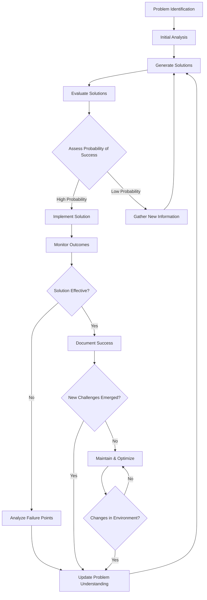

```mermaid
graph TD
    A[Problem Identification] --> B[Initial Analysis]
    B --> C[Generate Solutions]
    C --> D[Evaluate Solutions]
    D --> E{Assess Probability of Success}
    E -->|High Probability| F[Implement Solution]
    E -->|Low Probability| G[Gather New Information]
    F --> H[Monitor Outcomes]
    G --> C
    H --> I{Solution Effective?}
    I -->|Yes| J[Document Success]
    I -->|No| K[Analyze Failure Points]
    K --> L[Update Problem Understanding]
    L --> C
    J --> M{New Challenges Emerged?}
    M -->|Yes| L
    M -->|No| N[Maintain & Optimize]
    N --> O{Changes in Environment?}
    O -->|Yes| L
O -->|No| N
```
